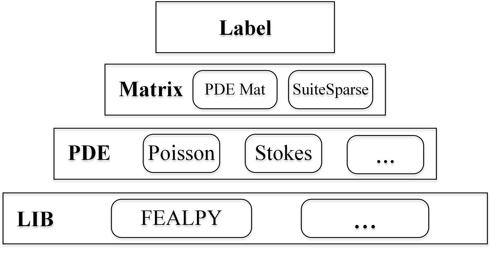

# OpenMat

`OpenMat` is a parallel sparse matrix data generator based on PDE discretization designed for intelligent iterative methods. It can not only generate matrix data, but also compute the label of the matrix. In `OpenMat`, both matrix generation and label computation can be accelerated through task parallelism.

The architecture of `OpenMat` is:



Based on `FEALPY`, `OpenMat` can generate matrices with different sizes and properties by adjusting discretization parameters.  In the future, we will add more PDEs, and support other libraries, such as `FEniCS`, `MFEM`. The features of `OpenMat` include:

- **Label Computation**: In addition to matrix generation, `OpenMat` utilizes various iterative methods provided by `PETSc` to solve the the same linear equation, and the fastest iterative method is the label of the matrix.
- **Support for Multiple Programming Languages**: Both matrix generation and label computation can be implemented by different programming languages (`C/C++`, `python`, etc. )
-  **Support for SuiteSparse**: Providing the matrix ID is sufficient to download the corresponding matrix in SuiteSparse matrix collection
- **Parallel Computing**: Multi-task parallelism
- **Checkpoint Restart**: The execution can be interrupted at any point during runtime. The program would skip previously completed computations and resume from the last checkpoint, avoiding  starting from scratch.
- **Matrix Reconstruction Based on Configuration File**: `OpenMat` employs the `GenerateMat()` function to create a matrix and simultaneously saves the input parameters to the corresponding `JSON` file. Therefore, by providing the matrix generation program and the corresponding `JSON` file, `OpenMat` can regenerate the matrix


# Installation

- `OpenMat`: `git clone git@github.com:zhf-0/matrix.git` or download the tar file directly
- Matrix generation and label computation can be used independently which need different softwares
  - Matrix generation: install `FEALPY` ([installation](https://github.com/weihuayi/fealpy)) and `ssgetpy` (download matrices from SuiteSpare Matrix Collection,  [installation](https://github.com/drdarshan/ssgetpy))
  - Label computation: install `petsc` and `petsc4py` ([offical PETSc doc](https://petsc.org/release/install/install_tutorial/#configuration))


**Note that: `OpenMat` can be used in cluster and desktop envirorments. For now, when it is used in the desktop, the `mpi` must be `openmpi` because of the processes binding** 

# Usage

## Matrix Generation

Using Poisson equation as the example

```python
# the dir that stores all json files 
json_dir = './JsonFiles/'

# the dir that stores all generated matrces
mat_dir = './MatData/'

# the name of the bash script that store all commands
script_path = gen.sh

# the header of the script `gen.sh`
header = ['#!/bin/bash \n']

# the footer of the script `gen.sh`
footer = ['echo finished !! \n']

# define a empty list to store all commands, then write to `script_path`
contents = []

# index of the matrix, use 100 as an example
idx = 100

# the type of output matrix, SciCSR: scipy.sparse.csr_matrix(default) 
#                            SciCOO: scipy.sparse.coo_matrix 
#                            COO: coo in txt format
mat_type = 'SciCSR'

# matrix name, the name has to be choosen from the following list:
# if the format is 'SciCSR', the name is 'scipy_csr{index}.npz'
# if the format is 'SciCOO', the name is 'scipy_coo{index}.npz'
# if the format is 'COO', the name is 'coo{index}.npz'
mat_path = os.path.join(mat_dir,f'scipy_csr{idx}.npz')

# output the right hand side vector
need_rhs = 1
# don't need to output the right hand side vector 
# need_rhs = 0

# pre-defined parameters in Poisson equation, including
# nx (mesh size in x axis), ny, etc
para = pde1.Para()

# define new parameters
para.DefineFixPara('mat_type',mat_type)
para.DefineFixPara('mat_path',mat_path)
para.DefineFixPara('need_rhs',need_rhs)

# create a json file that save all parameters of the generation
json_path = os.path.join(json_dir,f'result{i}.json')
json_result = {}

#the index of poisson problem is 1 in OpenMat
json_result['PDE_idx'] = 1 

# parameter.para is the dict that includes all values of the parameter 
# copy all paremeters to the json file
json_result['GenMat'] = para.para

# save json file 
with open(json_path,'w',encoding='utf-8') as f:
    json.dump(json_result,f,indent=4)

# create the command with command line parameters
# such as `line = --nx 10, --ny 10 --mat_type tri ...`
line = ' '
for k,v in para.para.items():
    line = line + f' --{k} {v} '     
one_command = 'python ./PDEs/poisson_lfem_mixedbc_2d.py' + line + '\n'

# add the command into the list 
contents.append(one_command)

# the codes above only concern about one matrix
# if the commands for all matrices is generated, then save them to file
with open(script_path,'w',encoding='utf-8') as f:
    f.writelines(header)
    f.writelines(contents)
    f.writelines(footer)
```

More details can be found in `main_generate.py`. 

## Label Computation

using `petsc`

```python
# the dir that stores all yaml files, each yaml file store the 
# solving result of the matrix only temporarily.  
yaml_dir = './YamlFiles'

# the same dir as in the matrix generation step,
# the program will extract the information from yaml file
# to the json file 
json_dir = './JsonFiles'

# change the matrix file in `mat_dir` in matrix generation step
# to petsc binary file and save the binary file into another dir
mat_dir = 'PetscMat'

# each iterative method will solve 3 times for average
batch_size = 3 

# the number of scripts that will be generated
num_task = 8

# the command used to sovle linear equations based on petsc
command = './Solve/rs -ksp_type {} -pc_type {} -mat_file {} -yaml_file {} \n'

# all matrix indexs, use [0,1,...999] as an example
idx_list = list(range(1000))

# the name template of the matrix file generated in last step
mat_template = './MatData/scipy_csr{}.npz'

# the name of the bash script that store all commands
script_file = 'solve.sh'

# the header of the script
header = ['#!/bin/bash \n']

# the footer of the script
footer = ['echo finished !! \n']

# create an instance of the class and begin to process
a = ParTaskParRunCluster(json_dir,yaml_dir,mat_dir,batch_size,idx_list,num_task)
a.Process(mat_template)
a.GenerateScript(script_file,header,footer,command)
```

